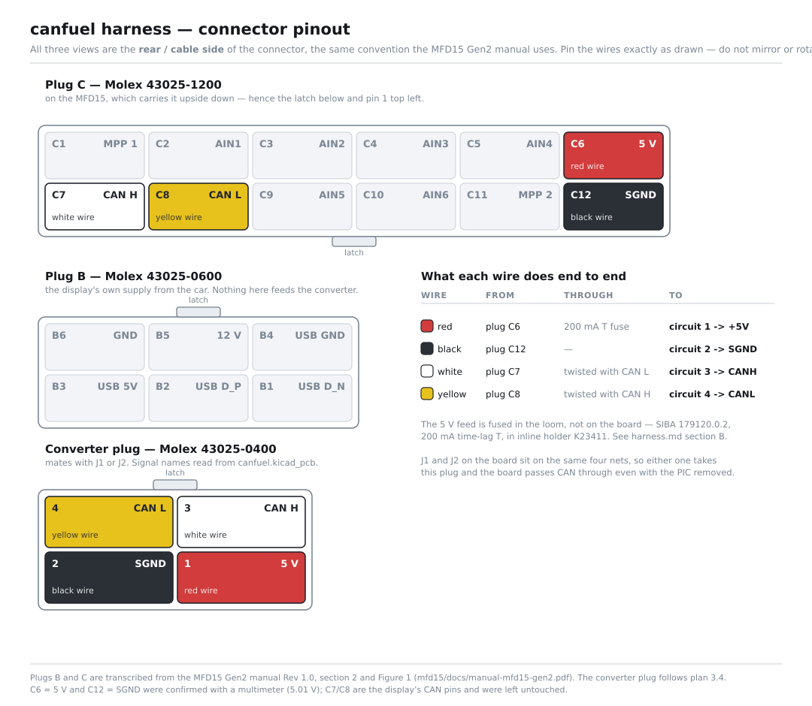

# Connector pinout

The one page to look at when a wire is in your hand and you need to know which
cavity it goes in. It covers the three connectors this project touches: the two
plugs on the MFD15 and the plug that goes onto the converter board.

**Every view is the rear / cable side of the connector**, which is the
convention the MFD15 manual sets and the only one worth having: it is the view
you have in front of you while you push crimps in. Section 2 of the manual puts
it plainly — *"All pinout diagrams show the rear/cable side of the connector.
Pin the wires exactly as shown in this view — do not mirror or rotate them."*
The same rule applies to everything below.

**Go by the latch, and the numbering stops looking arbitrary.** Every one of
these housings numbers from the corner away from the latch: circuit 1 sits
bottom right when the latch is up. Plugs A and B on the MFD15 have the latch
up, so they read `A4 A3 / A2 A1` and `B6 B5 B4 / B3 B2 B1` — pin 1 bottom
right. **Plug C is mounted upside down on the MFD15 body**, latch down, so the
same rule puts pin 1 top left and the numbers run `C1…C6` along the top. It is
one rule seen from two ways up, not two conventions, and the latch in each
drawing is what tells you which. The converter plug has its latch up, like A
and B.

The latch positions were read off the hardware, not off a drawing — no document
in either repository states them.

---

## Plug C — Molex 43025-1200, on the MFD15

Twelve circuits, of which this project uses four.

| Pin | Signal | Ours | Wire   |
| --- | ------ | ---- | ------ |
| C6  | 5 V    | yes  | red    |
| C7  | CAN H  | yes  | white  |
| C8  | CAN L  | yes  | yellow |
| C12 | SGND   | yes  | black  |

The other eight (C1 MPP 1, C2 AIN1, C3 AIN2, C4 AIN3, C5 AIN4, C9 AIN5,
C10 AIN6, C11 MPP 2) belong to the display and are not wired here.

**C7 and C8 were already crimped and are not to be disturbed** — they are the
display's own CAN pins. C6 and C12 are the two sockets this project adds.

## Plug B — Molex 43025-0600, on the MFD15

| Pin | Signal   | Ours |
| --- | -------- | ---- |
| B5  | 12 V     | no   |
| B6  | GND      | no   |
| B1–B4 | USB    | no   |

This is the display's own supply from the car. **Nothing on plug B feeds the
converter** — the converter's 5 V comes from plug C, and the 12 V branch was
dropped from the board design.

## Converter plug — Molex 43025-0400

Mates with J1 or J2 on the canfuel board; both headers are on the same four
nets, so either will do.

| Circuit | Net  | Wire   | From    |
| ------- | ---- | ------ | ------- |
| 1       | +5V  | red    | plug C6 (through the fuse) |
| 2       | SGND | black  | plug C12 |
| 3       | CANH | white  | plug C7  |
| 4       | CANL | yellow | plug C8  |

Circuits 1 and 2 are the row nearest the PCB; 3 and 4 the row further from it.
The latch is up and the moulded `1` is the bottom right cavity, so **3 sits
directly above 1 and 4 diagonally from it**.

---

## Where these numbers come from

- **The converter plug's signal names are read out of `canfuel.kicad_pcb`**,
  not typed in — the figure is generated from the pad nets of J1, so it cannot
  drift from the board. The order itself is fixed by implementation-plan 3.4.
- **Plugs B and C are transcribed from the MFD15 Gen2 manual Rev 1.0**,
  section 2 and Figure 1, in the sibling repository at
  `mfd15/docs/manual-mfd15-gen2.pdf`. The manual is the authority; if this page
  ever disagrees with it, the manual wins and this page is the bug.
- **C6 = 5 V and C12 = SGND were confirmed with a multimeter** (5.01 V). That
  is a fact about the car, not about a part, so it is settled by measurement —
  see the sourcing rule in the top-level `CLAUDE.md`.

- **The latch positions are observed**, on the plugs and on the display body.
  They are the only thing on this page with no document behind them, and they
  are also what makes the rest of it legible.

**One useful cross-check fell out of the manual.** The display's own plug A is
a Molex **43025-0400** — the same housing as the converter plug — and Figure 1
draws it, cable side, as `A4 A3` over `A2 A1`. Circuit 1 bottom right is
exactly how the physical housings are moulded, so the cavity layout is now
corroborated by a document rather than resting on convention alone.

What that still does not prove is that circuit *n* of the receptacle mates with
circuit *n* of the header — that much is Micro-Fit convention, and no datasheet
in this repository states it. **Ringing circuit 1 out to the board's +5V pad
before the first power-up is what closes it**, and it takes a minute. Swapping
CAN H and CAN L only stops the bus working; a CAN wire in circuit 1 or 2 meets
5 V, which plan 3.4 calls a dead transceiver.

## See also

- `harness.md` — building the loom, step A4a for fitting these crimps
- `harness-connector.svg` — the plug and the board pads side by side
- `harness-nets-on-pcb.svg` — the same four nets on the real copper
- `implementation-plan.md` 3.4 — why the pin order is what it is
